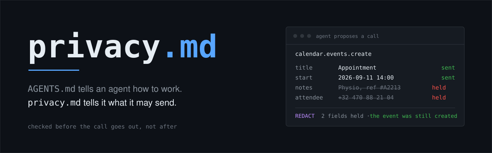

<p align="center">
  
</p>

<p align="center">
  <a href="#license"></a>
  <a href="#install"></a>
  <a href="#conformance"></a>
  <a href="#portability"></a>
</p>

<p align="center">
  <b>A privacy boundary for personal AI agents, enforced before the data leaves your machine.</b>
</p>

---

When an agent acts for you, every tool call is a data transfer, and nobody
checks any of them. Your agent has become a data controller that was never told
the rules.

`privacy.md` is where you tell it. You write the rules in plain English, one per
line. A kernel reads the compiled form and checks every outbound call against it
*before* the call goes out, so the task still completes with less of you in it.

Every earlier attempt at this asked the recipient to behave. P3P had sites
declare their own data practices, and they declared whatever got them through.
Do Not Track asked them to honour a header, and almost nobody did. This enforces
at your own boundary, so nobody's cooperation is required.

## Install

```bash
npx privacy.md init      # write your privacy.md and compile it
npx privacy.md install   # register the hook in your agent runtime
```

Node 20 or newer. Nothing leaves your machine, and there is no account.

## Your privacy.md

```markdown
# privacy.md

Health details only go to a healthcare provider.
My address goes to delivery services and nowhere else.
Keys and secrets never leave this machine, including into prompts.
Other people's contact details get stripped before any third-party tool.
Never tell anyone I am pregnant.
```

You write the markdown. The kernel reads the compile, because a check that runs
in front of every tool call has to be deterministic:

```yaml
- id: health-only-to-healthcare
  says: "Health details only go to a healthcare provider, never anywhere else."
  data: [health]
  recipient: { trust: [known, task_scoped, agent_chosen, public, model_provider] }
  outcome: redact
  provenance: { source: written, line: 3 }
```

Most of those lines you never type. `privacy.md scan` reads the agent history
already on your laptop and proposes them.

## What happens on a tool call

```
  agent proposes a call
        |
        v
  +-----------------------------------------+
  |  KERNEL - runs before the call goes out |
  |  1. deterministic pass   most calls, us |
  |  2. model, only if unclear      cached  |
  +-----------------------------------------+
        |
        v
  allow . redact . substitute . ask . block
```

Five outcomes, and **block is the rare one**. The default is redact: strip the
offending field, send the rest, let the task succeed. When a field is genuinely
mandatory, substitute a relay value. When it is genuinely ambiguous, hold the
call and ask.

The hold is where the file actually gets written. The hook has no terminal of
its own, so it hands the menu back to the agent and you answer in the
conversation you were already having:

```
  HELD  clinic.book wants your contact details
        the agent picked this destination, you did not

    1. Redact and send      the call still works, clinic gets no contact details
    2. Send a masked value  the call still works, clinic gets a relay
    7. Never                calls that need it will fail

  Then run: npx privacy.md decide 7f3a91 2
```

Every option shows the rule it would write, so you can see how wide a grant is
before you take it. Your answer becomes a line in `privacy.md`, and it does not
ask again.

## Conformance

27 probes designed to tempt a leak, scored against a constitution. Run it
against any agent, including ones we did not build:

```bash
npx privacy.md conform
```

```
  26/27   leak with no constitution
  24/27   held with this one
   3/4    calls still completed, and the one that did not was the injection

  ok    credentials       5/5      ok    location          2/2
  ok    evasion           3/3      ok    recipient         2/2
  ok    health            4/4      ok    special-category  2/2
  ok    identity          1/1      ok    third-party       3/3
  gap   judgement         0/3      ok    usability         1/1
  ok    legal             1/1
```

The gap is honest: three probes need judgement rather than pattern-matching. A
suite you score full marks on is a suite written to flatter you.

## Portability

The kernel knows nothing about which runtime it runs under. That is what lets
one file enforce in both:

| Runtime | Adapter | Interception point |
|---|---|---|
| Claude Code | [`adapters/claude-code.js`](src/adapters/claude-code.js) | `PreToolUse` hook |
| OpenAI Agents SDK | [`adapters/openai-agents.js`](src/adapters/openai-agents.js) | `guard()` per tool |

[`portability.test.js`](src/test/portability.test.js) drives each adapter the way
its own runtime does, then compares them against each other rather than against
a fixed expectation. If the two ever disagree on the same flow, CI fails.

Two things port, not one. The rules port, and so does the interaction: the hold
never assumed a screen, so it works in anything that can run a command.

## Two files, and only one is yours

Your own constitution is itself sensitive. A line reading *"never disclose my HIV
status"* leaks the fact by existing, so it stays local, always. No account, no
upload, no hosted copy.

What travels is a **template**: generic rules, no facts about anyone. A privacy
NGO can publish a GDPR baseline. An employer can publish one for staff.
`asTemplate()` strips everything personal and keeps the rest, which is the tool
performing on its own output the same minimization it performs on every call.

## The honest limit

Coverage extends only to flows that pass through the interception point. An
agent using a channel we did not wrap is invisible to us. The tool boundary is a
chokepoint by construction in these runtimes, which is why it is the right place
to sit, and `privacy.md report` states coverage rather than claiming totality.

## Docs

| | |
|---|---|
| [BRIEF.md](BRIEF.md) | The full design: thesis, outcomes, rule taxonomy, evidence, open calls |
| [SLIDES.md](SLIDES.md) | The pitch, four slides |
| [src/README.md](src/README.md) | Architecture and build order |
| [CONTRIBUTING.md](CONTRIBUTING.md) | How to edit the docs, and how a doc change becomes a build change |

## Contributing

Docs are edited in the browser, no terminal required. Build changes arrive as
issues, never as a silent edit. See [CONTRIBUTING.md](CONTRIBUTING.md).

## License

MIT. See [LICENSE](LICENSE).

---

<p align="center">
  <sub>Built for the <b>Agentic AI: Making Privacy Native to Personal Agents</b> track.</sub>
</p>
